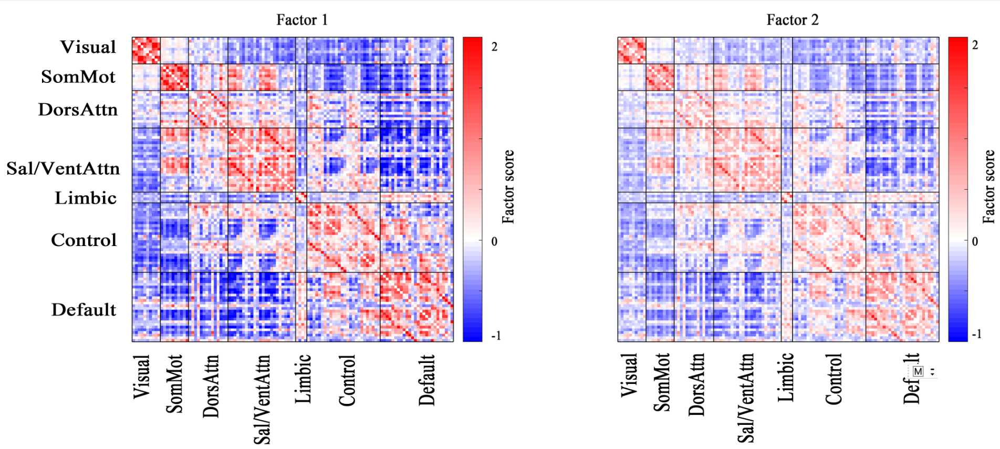
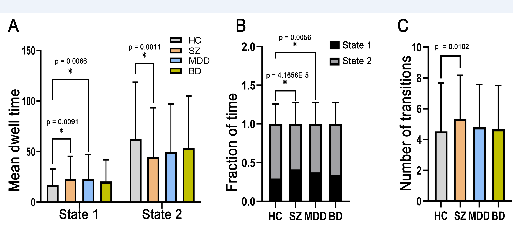
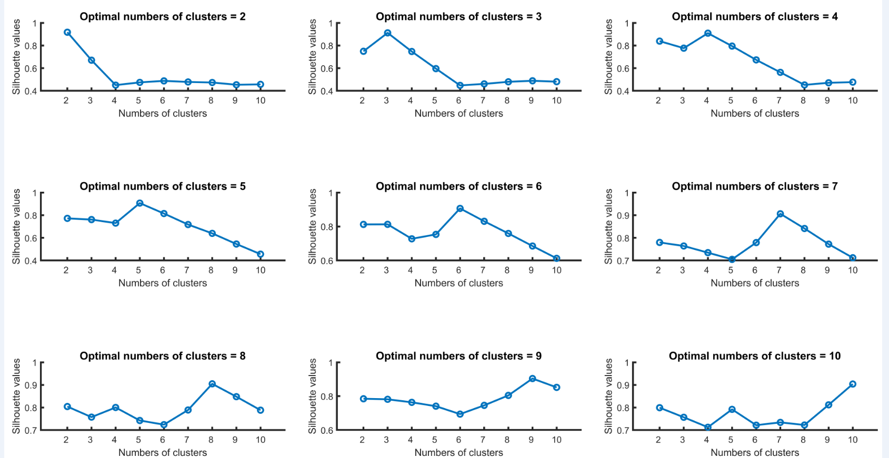
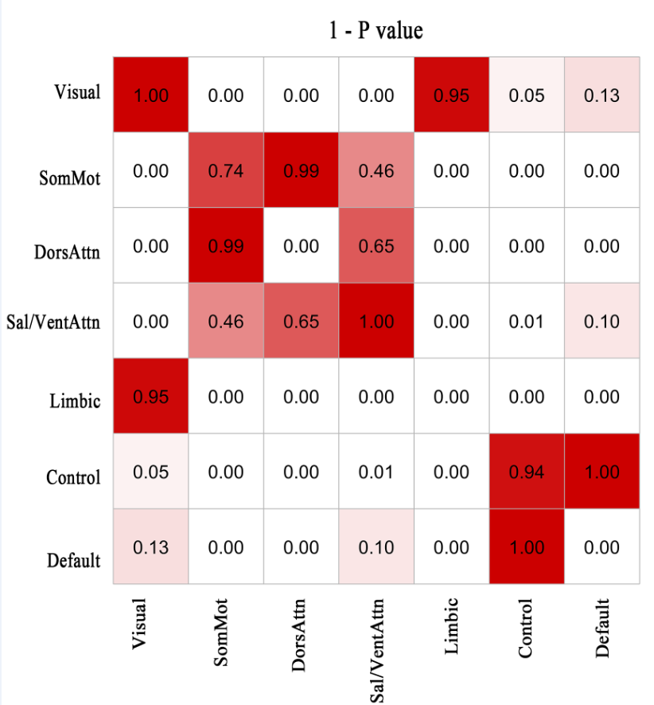

# Reviewer(s)' Comments to Author:   
***
### Referee: 1     
3. K means clustering will cluster data even when the underlying data structure is dimensional.  The authors should explicitly compare a categorical model with a dimensional one (dimensional latent construct with multiple indicators).  

>我使用了的因子分析（latent method）从所有窗口的动态连接中提取因子。为了与kmeans的结果有对比性，因子的数目由kmeans决定的最佳质点数K来决定。最终，我们提取了2个latent的factors,辅组材料中有这两个factors的图。我们可以发现，这2个由因子分析得到“脑状态”与我们的用kmeans发现的2个脑状态是基本一致的：一个是强的网络内正连接以及强的网络间负连接，另一个是弱的连接。

4. There is much discussion in the literature of DFC being an artifact of variations in arousal state over time.  How would the authors rule out this confound? 
doi: 10.1093/cercor/bhw265. 
doi: 10.3389/fnins.2019.01190 
doi: 10.1016/j.neuroimage.2019.07.004  

>越来越多的研究采用DFC来研究正常人以及精神疾病患者的脑功能异常。举例:那篇NC的DFC文章，以及审稿人给出的下面这篇文章。 
>在被试的静息态扫描过程中，被试很难一直维持在高的警觉状态，警觉状态的波动本质上也是一种正常的现象（见我们的temploral_properties.C
>图）。
>首先，我们发现的两个状态是可以在不同的人群中得到重复的（NC的那一篇以及我们在held out samples 上再次聚类的结果）。其次，对于磁共振数据的采集来讲，在扫
>描开始我们会要求被试放松但是不要睡觉。   
  
>另外我们就算了动态连接的一些metrics，比如状态驻留时间，状态切换次数的，进一步探索DFC的神经生理学意义。     

>1.根据审稿人提供的文献：'Vigilance declines following sleep deprivation are associated with two previously identified dynamic
>connectivity states',state1可能倾向于是高警觉状态（高的网络内连接，以及高DMN与SN、VAN负连接）。而state2可能更倾向于是低警觉状态（weak 
>anti-correlations between taskpositive networks (dorsal attention network (DAN), ventral attention/salience network (
>VAN), executive control network (ECN)) and the default-mode network (DMN).）。
>
>2.根据图3我们可以做出推断：精神疾病（主要是SZ）在高警
>觉状态驻留时间/分数时间都更多，而在应该维持的低警觉（静息状态）驻留时间更短。如果考虑到精神疾病患者相较于正常人来说更多疑，猜忌，被迫害妄想，
>以及对陌生环境更容易产生警觉,那么这个结果将不是一个非常出乎意料之外的。更有趣的是，病人所有的差异都只在低警觉状态（静息态）时表现出来，而在高警觉状态时，脑功能连接跟正常人没有统计学差异。这个结果可能提示了参与我们研究的精神疾病患者脑功能具有一定的正常功能储备，即在高的警觉状态脑功能可以维持在正常状态，但是在大多数非高警觉状态（或者静息态）基础脑功能时存在显著异常的。  

>3.根据图temploral_properties.C: 精神疾病患者的的状态转换更加频繁，可能间接反映了精神疾病患者的脑网络状态的破碎性。
  
>4.现在DFC领域存在争议。有人说DFC只是睡眠与否或者头动的一种反映。我们毕竟没有同步记录脑电图来确保被试的动态觉醒状态。因此我们将这一点写入到limitations中，以便提示读者需要考虑。  
  
  

***
## Referee: 2 

1.  Why was the silhouette out of all clustering validity metrics? I have no problem with silhouette, it just should be justified, and the reasoning should be explained to the reader. 
>没有想好如何回复。

2.   Was anything done to account for the fact that lower numbers of clusters tend to be more similar. Using raw cluster validity metrics can therefore be biased towards selecting lower numbers of clusters. Some research use an elbow method or local minimum method or something similar to adjust for this. Was anything like this considered?      
>1.我用模拟的数据来说明不是lower number 导致more similar。具体做法就是模拟从2到10个类别的数据（维度：1000*2），然后分别用kmeans聚类结合silhouette 标准将各个模拟数据聚类成从2-10个类别（见下图）。
>代码：https://github.com/lichao312214129/lc_rsfmri_tools_matlab/blob/master/Workstation/code_workstation2018_dynamicFC/validation/lc_silhoutte_simulation.m

3. In the discussion the authors seem to focus on a handful on networks including the FPN, DMN and sensory networks. However, as far as I can tell there are significant group differences in edges that fall within every network and nearly every within and between network connection. Why were specific network differences emphasized?  The authors should consider formally testing whether significant edges tended to fall within specific networks than would be expected by chance. There are more edges in some networks, and networks have structured spatial patterns. Therefore if the authors want to make inferences about certain networks being overrepresented they should formally test this and use statistical methods that account for spatial autocorrelation. See examples and methodological implementation of this method below:   
The discussion should reflect the results of these formal tests for network specificity or remain more descriptive and avoid overemphasizing specific network connections.  
Alexander-Bloch et al., “On testing for spatial correspondence between maps of human brain structure and function.”  Neuroimage 2018   
Reardon et al., “Normative brain size variation and brain shape diversity in humans.” Science 2018.    
>6和7的问题本质是一个问题。目前，我已经根据这两篇文献中的方法做了置换检验。我们生成与真实网络同样节点数，同样的连接数，以及同样的度分布的5000个随机网络。将真实网络中落在各个子网络的差异连接对子数与随机网络中的进行对比，我们得到了各个子网络差异连接对子数是否具有统计学差异。

